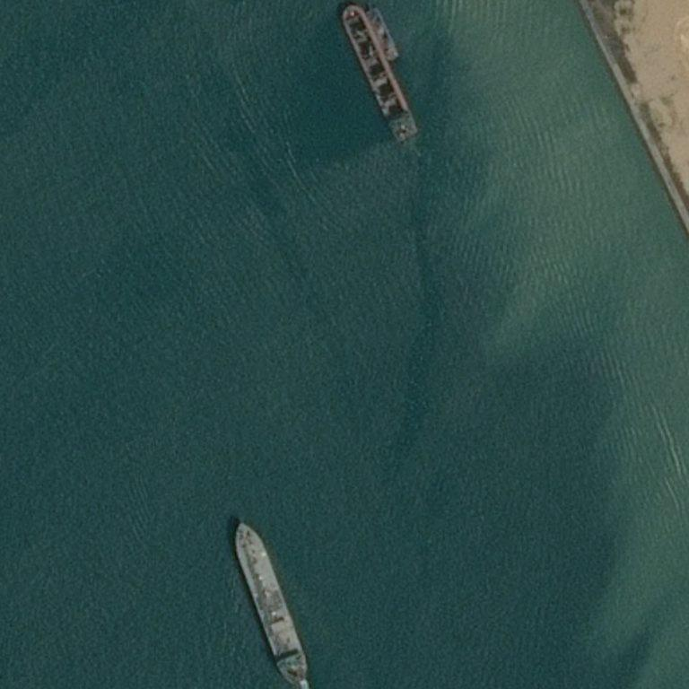
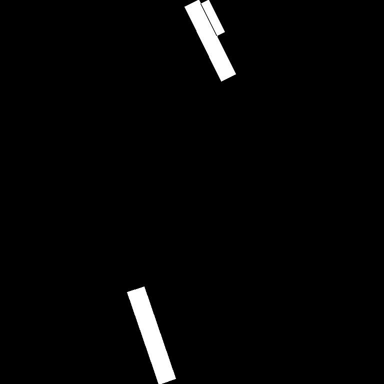
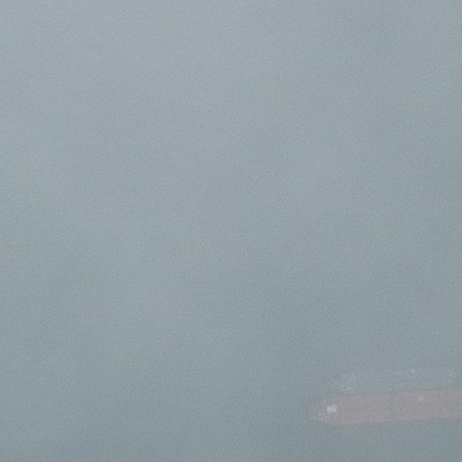
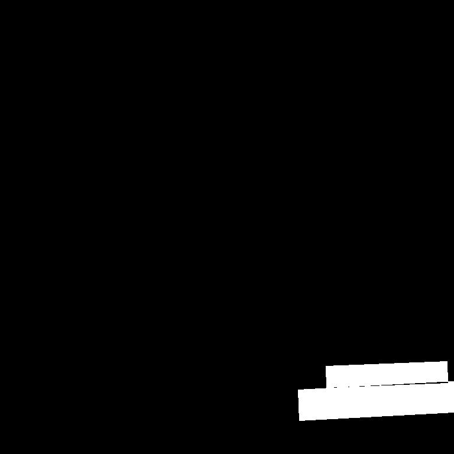

# Ship Segmentation Project

This repository contains the code for a project involving model training, inference, and evaluation for ship segmentation using U-Net. The main components of this project are structured into various Python scripts and notebooks.

### Overview

Trains a U-Net model for image segmentation using specified data generators, with learning rate scheduling and model checkpointing.

### Ready-Made Trained Model

A ready-made trained model is available for use in prediction. You can download the trained model from the following link:

[Download Trained Model](https://huggingface.co/AnnaDee/ship_segmentation/blob/main/model.h5) 

## Project Structure

```
ship_segmentation_project/
├── assets/
│ ├── images/ # Store original images here
│ ├── masks/ # Store segmented masks here
├── configs/
│ ├── config.py # Configuration file for the project
├── data/
│ ├── preprocess.py # Script for preprocessing the data
├── models/
│ ├── dice_coefficient.py # Dice coefficient implementation
│ ├── training.py # Training script for the U-Net model
│ ├── unet.py # U-Net model definition
├── notebooks/
│ ├── EDA.ipynb # Data Analysis notebook
├── scripts/
│ ├── generate_data.py # Script for generating data
│ ├── inference.py # Inference script
├── utils/
│ ├── init.py # Init file for utils module
│ ├── rle.py # Run Length Encoding utilities
├── .gitignore # Git ignore file
├── README.md # Project documentation
└── requirements.txt # Python dependencies
```

## Setup Instructions

### Prerequisites

The project dependencies are listed in requirements.txt and include:

  - Python 3.8+
  - TensorFlow 2.10.0
  - NumPy 1.26.3
  - Pandas 2.2.2
  - Pillow 10.2.0
  - OpenCV 4.7.0.72
  - Scikit-learn 1.4.1.post1

### Installation

1. Clone the repository:

    ```bash
    git clone https://github.com/yourusername/ship_segmentation_project.git
    cd ship_segmentation_project
    ```

2. Create and activate a virtual environment:

    ```bash
    python -m venv venv
    ```

    **On Windows:**

    ```bash
    .\venv\Scripts\activate
    ```

    **On macOS/Linux:**

    ```bash
    source venv/bin/activate
    ```

3. Install the required packages:

    ```bash
    pip install -r requirements.txt
    ```

## Configuration

Update the `configs/config.py` file with the necessary configuration settings. Make sure to specify the correct paths for your data and other resources in this file.

### Example Images

| **Original Image** | **Segmented Image** |
|-------------------|--------------------|
|  |  |
|  |  |


### Example Images in a 2x2 Table with Smaller Sizes

<table>
  <tr>
    <th>Original Image</th>
    <th>Segmented Image</th>
  </tr>
  <tr>
    <td></td>
    <td></td>
  </tr>
  <tr>
    <td></td>
    <td></td>
  </tr>
</table>


<div style="width: 50%; margin: auto;">
  <table>
    <tr>
      <th>Original Image</th>
      <th>Segmented Image</th>
    </tr>
    <tr>
      <td></td>
      <td></td>
    </tr>
    <tr>
      <td></td>
      <td></td>
    </tr>
  </table>
</div>


## Data

  - Data can be downloaded from the [Kaggle Airbus Ship Detection Challenge](https://www.kaggle.com/competitions/airbus-ship-detection/data).

### Training the Model

To train the U-Net model, run:

```bash
    python models/training.py
```

### Usage

  1. Ensure paths and parameters are set in `configs/config`.
  2. Run the script to train the model, save checkpoints, and evaluate performance.

## Preprocessing Data

To preprocess and save images and masks, run:

```bash
    python data/preprocess.py
```

## Running Inference

To perform inference and visualize the results, run:

```bash
    python scripts/inference.py
```

Generates prediction masks using a pre-trained model, converts them to rectangular regions, and saves masks and results in CSV format.

## Custom Scripts

  - `utils/rle.py`: Contains functions to decode RLE masks.
  - `models/dice_coefficient.py`: Contains implementations of Dice coefficient and loss functions.

## Model Architecture

The U-Net model architecture is defined in `models/unet.py.`

The U-Net model architecture consists of two main parts: the `encoder` (contracting path) and the `decoder` (expanding path).

#### Encoder (Contracting Path)
Convolutional Layers: The encoder uses a series of convolutional layers to capture spatial features. Each convolutional block is followed by a ReLU activation function.
Pooling Layers: Max pooling operations are applied to reduce the spatial dimensions progressively, allowing the network to learn hierarchical features.

#### Decoder (Expanding Path)
Up-Convolutional Layers: The decoder path uses transposed convolutions to upsample the feature maps.
Skip Connections: Feature maps from the encoder are concatenated with the upsampled feature maps from the decoder. These skip connections help preserve spatial information and improve segmentation accuracy.
Final Convolution: A 1x1 convolution is applied at the end to produce the segmentation map, where each pixel is assigned a class label.